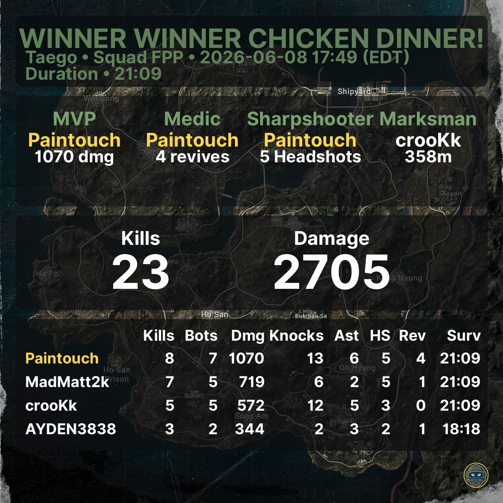
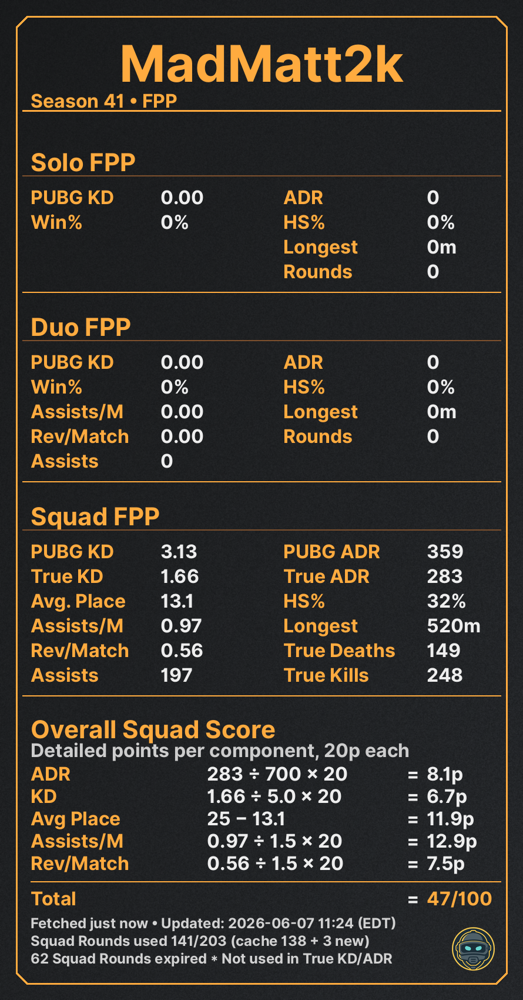
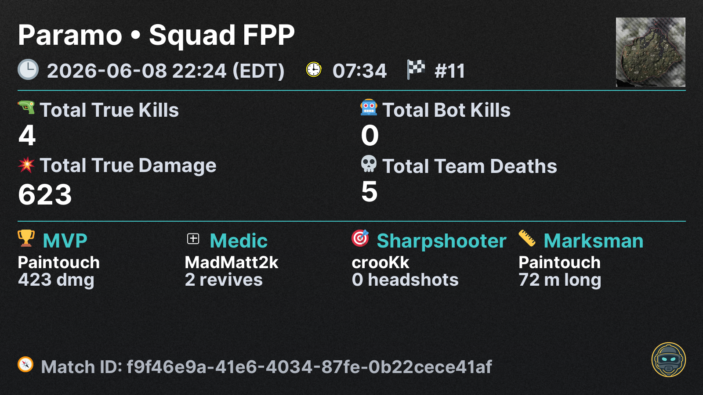
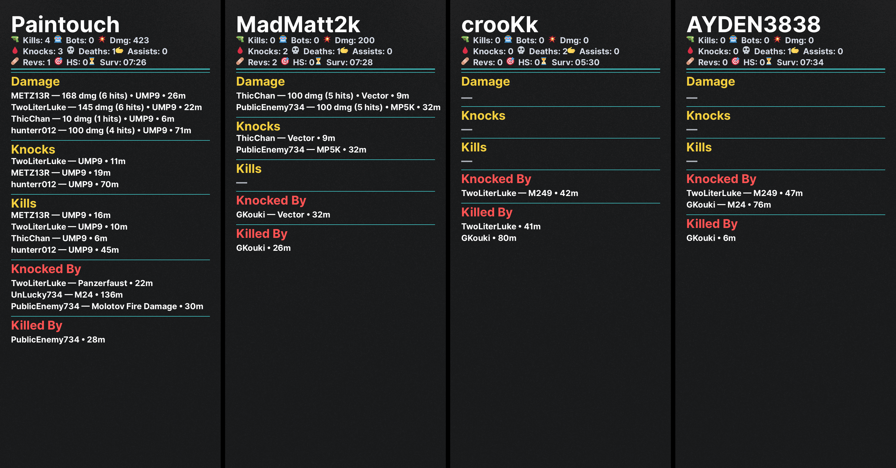
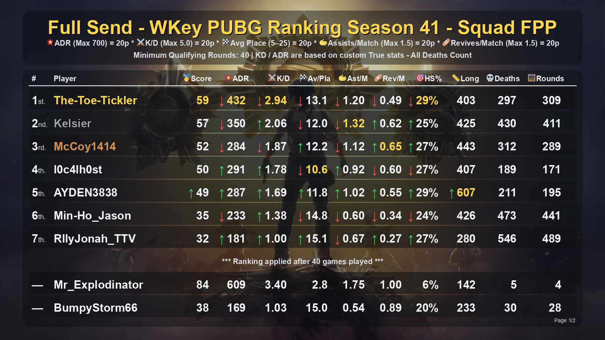
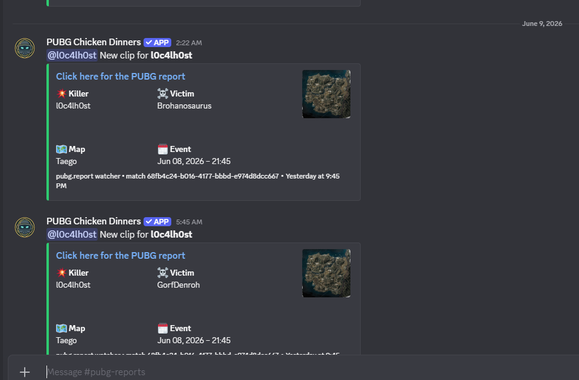
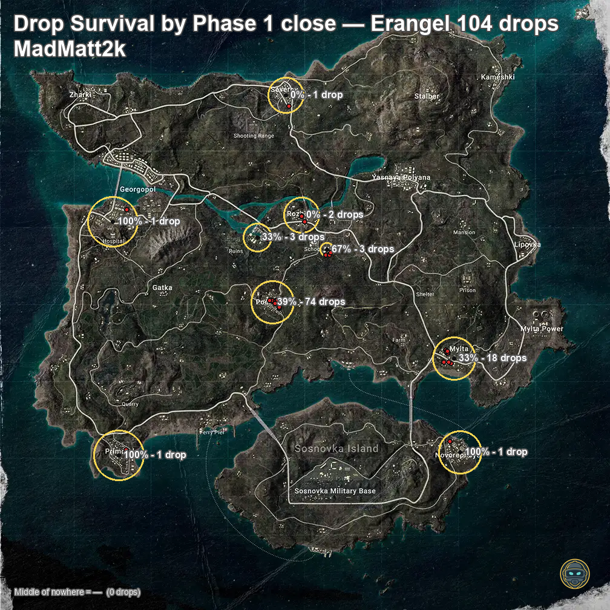

# 🐔 PUBG Chicken Dinner Bot

> The most feature-complete PUBG tracking bot for Discord. Built for serious squads, streamers, and competitive communities.

 

---

## 🔗 Links

- **Add to your server**: [top.gg/bot/1403723550141186118](https://top.gg/bot/1403723550141186118)
- **Privacy Policy**: [View Privacy Policy](https://madmatt2k.github.io/PUBG-Chicken-Dinners/privacy.html)
- **Terms of Service**: [View Terms of Service](https://madmatt2k.github.io/PUBG-Chicken-Dinners/terms.html)

---

## ✨ Features

### 🏆 Win Posters

Automatically detects when a tracked team wins and posts a custom win poster image — complete with map, mode, player stats, kills, damage, role awards (MVP, Medic, Sharpshooter, Marksman) and match duration.

---

### 📊 Stats & Comparisons

Pull current-season stats for any PUBG Steam player as a polished image — perspective follows your server's mode (FPP or TPP). Squad stats include **True KD and True ADR** — calculated from raw match telemetry, excluding bots and friendly fire, with all deaths counted. Includes a full score breakdown showing exactly how the player's ranking score is calculated.

---

### 📋 Last Match Reports

Detailed match reports posted automatically after every game. Includes a team summary card (map, placement, True Kills, True Damage, role awards) and a full per-player breakdown showing damage dealt, knocks, kills, weapons, ranges, and how each player was eliminated.

---

### 📈 Clan Rankings

Nightly auto-ranking images posted at 03:00 server time, scoring players across ADR, K/D, Avg Placement, Assists/Match, Revives/Match, HS%, Longest Kill and more. Each server independently chooses **Squad FPP or Squad TPP** as its ranking mode. Supports on-demand posting and per-player visibility controls. Players below the qualifying threshold are shown unranked at the bottom.

---

### 🎬 PUBG.report Clip Tracking

Monitors pubg.report and auto-posts clips when tracked players eliminate streamers. Each post includes killer, victim, map, and a direct link to the clip. Pings the linked Discord member if configured.

---

### 🗺️ Drop Survival Heatmap

Visualize where a tracked player lands across all their games on a given map, broken down by POI with Phase-1 survival rates and drop counts. Instantly see where they thrive and where they struggle.

---

### 🔀 FPP & TPP Support

The bot tracks both perspectives simultaneously for every player — no re-tracking needed. Each server independently chooses Squad FPP or Squad TPP as its ranking mode. Rankings, stat cards, and comparisons all reflect the server's chosen perspective. Switch anytime with `/auto-clan-ranking` → `setmode`.

---

### ⚙️ Fully Configurable

- Per-feature channel selection
- Per-player ignore/enable controls for every auto-feature
- Server timezone support for accurate timestamps
- Discord member linking for @ mention pings on new clips
- Manage Server permission gating for all admin commands

---

## 🚀 Getting Started

1. [Add the bot to your server](https://top.gg/bot/1403723550141186118)
2. Use `/add-user` to add your first PUBG player
3. Use each auto-feature's `setchannel` action to configure your posting channel
4. Enable features with `/auto-win enable`, `/auto-lastmatch enable`, etc.
5. Run `/help` anytime to see all available commands

---

## 📋 Commands Overview

| Category        | Commands                                                                                        |
| --------------- | ----------------------------------------------------------------------------------------------- |
| Stats           | `/stats` `/compare` `/lastmatch` `/accountinfo`                                                 |
| Heatmaps        | `/dropsurvival` `/endzone`                                                                      |
| Tracking        | `/add-user` `/remove-user` `/list-tracked-users` `/link-player`                                 |
| Rankings        | `/global-player-ranking` `/global-guild-ranking` `/auto-clan-ranking`                           |
| Auto Win        | `/auto-win` `/auto-win-ignore-player` `/auto-win-enable-player`                                 |
| Auto Report     | `/auto-pubg-report` `/auto-pubg-report-ignore-player` `/auto-pubg-report-enable-player`         |
| Auto Last Match | `/auto-lastmatch` `/auto-lastmatch-ignore-player` `/auto-lastmatch-enable-player`               |
| Auto Ranking    | `/auto-clan-ranking-ignore-player` `/auto-clan-ranking-enable-player`                           |
| Testing         | `/testwin` `/testreport`                                                                        |
| Admin           | `/set_server_timezone` `/change-update-channel` `/help`                                         |

---

## 🔒 Privacy & Data

This bot collects PUBG player IDs, display names, and match statistics sourced from the official PUBG API. Data is stored locally per guild and per season, and is automatically cleaned up on season reset. No data is sold or shared with third parties.

For full details see our [Privacy Policy](https://madmatt2k.github.io/PUBG-Chicken-Dinners/privacy.html) and [Terms of Service](https://madmatt2k.github.io/PUBG-Chicken-Dinners/terms.html).

---

## ⚠️ Disclaimer

PUBG Chicken Dinner Bot is not affiliated with or endorsed by KRAFTON, Inc. PUBG and all related marks are trademarks of KRAFTON, Inc.

---

*Supports Steam (PC) only. Requires the PUBG API.*
